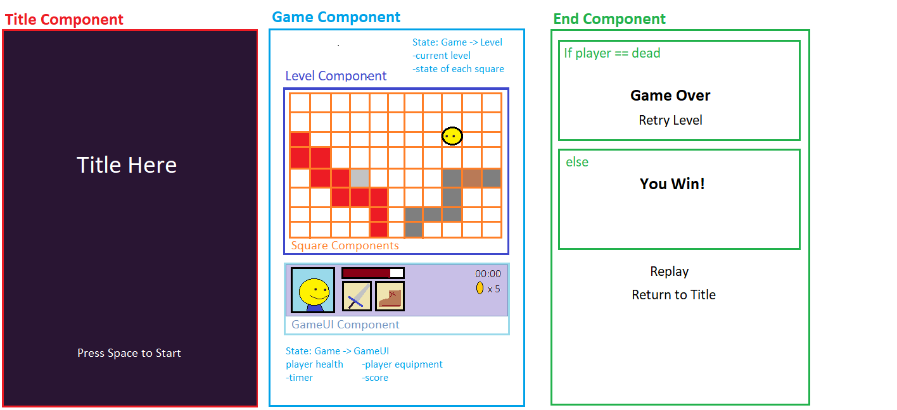

## _Capstone: Grid-based Adventure Game_

### _***Kevin Garvey***_

### _Description:_
##### _A stateless mockup of my planned capstone project. It currently allows users to proceed through the title screen to generate a hard-coded level map. The player can then click on a lick to view the game over screen from which they can restart the "game" or return to the title screen. 7/19/19_

### _Specs_
|Component|Concern|
|---|---|
|App|Entry point for application|
|Title|Displays an image and prompts the user to start the game|
|Game (stateful)|Handles overarching game logic such as tracking player hp. Includes the Level and GameUI components|
|GameUI|Display user status, items, time played, etc.|
|Level|A grid of Square components which will be navigated by the user|
|Square|Tiles that compose the level. They have properties that define their type and wheather the player on an enemy is currently on the tile.|
|End|Triggered by either the player's death or the completion of the game and returns a unique div for each state.|

  

### _Setup/Installation_

- _Clone the React-Tap-Room directory from https://github.com/kmgarvey279/React-Tap-Room._
- _Navigate to the cloned folder and run `npm install` in the command line._
- _Run `npm start` to start host the site at `http://localhost:8080`_

### _Support and contact details_

_Please contact me at kmgarvey279@gmail.com if you have any questions or comments._

### _Technologies Used_
_- ES6 - JSX - React - Redux - Lint - Webpack -_  

_This software is licensed under the MIT license._

This project was bootstrapped with [Create React App](https://github.com/facebook/create-react-app).